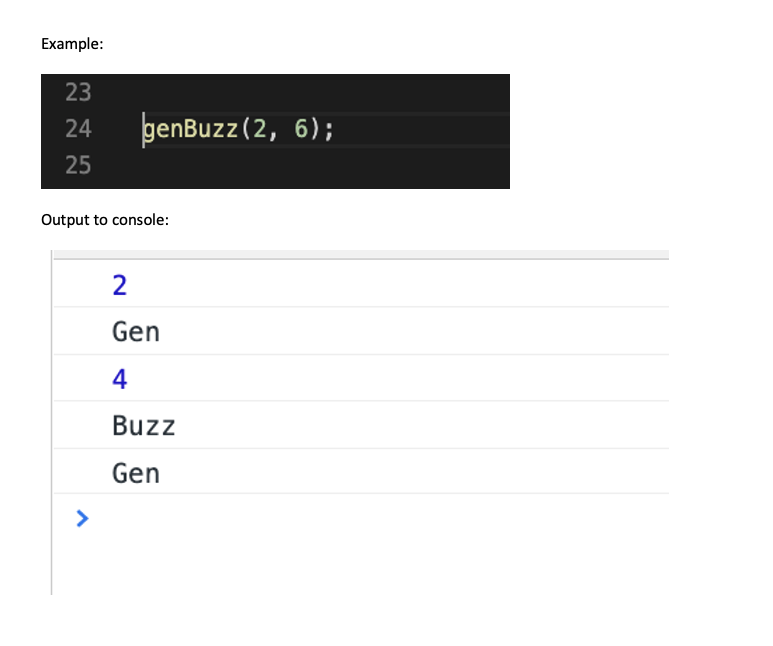

# Please Fork and Clone project prior to working on problems (instructions listed below).

1. GenBuzz Function
        
   * Write a function that prints (to the console) numbers from a `lowerLimit` to an `upperLimit`.
   * For numbers divisible by 3, print “Gen”
   * For numbers divisible by 5, print “Buzz”
   * For numbers divisible by both 3 and 5, print “GenBuzz”
   * Check to make sure that inputs are numbers
     * If they are not numbers, use template literals to print the input along with a message informing that the input is not a number.
   * Ensure that `lowerLimit` is smaller than `upperLimit`.
     * If input for `lowerLimit` is larger than `upperLimit`, use template literals print a statement informing the user that the lowerLimit is larger than the upperLimit.
     
     

2. Leap Year

    A leap year is a year containing one additional day added to keep the calendar year synchronized with the astronomical or seasonal year. Because seasons and astronomical events do not repeat in a whole number of days, calendars that have the same number of days in each year drift over time with respect to the event that the year is supposed to track. By inserting an additional day or month into the year, the drift can be corrected. A year that is not a leap year is called a common year.

    Every year that is exactly divisible by four is a leap year, except for years that are exactly divisible by 100, but these centurial years are leap years if they are exactly divisible by 400. For example, the years 1700, 1800, and 1900 are not leap years, but the year 2000 is.

    Write a program that returns a message informing a user whether or not the year that is input is a leap year. Ex. When `isLeapYear(2000)` is called, it should return the value `2000 is a Leap Year`. Test your code by printing the funcition's output to the console.

3. Perfect Square

    A perfect square is a number that can be expressed as the product of two equal integers. For example, 9 is a perfect square because it can be expressed as 3 * 3 (the product of two equal integers). 16 is a perfect square because it can be expressed as 4 * 4 (the product of two equal integers). 5 is NOT a perfect square because it cannot be expressed as the product of two equal integers. 7 is not a perfect square because you cannot express it as the product of two equal integers.

    Write code to create a function that accepts a number and returns true if the number is a perfect square, otherwise it returns false.

    You may not use the built-in Math.sqrt method

## Part 1 - Fork and Clone the project

* Begin by _forking_ this project into a personal repository.
   * To do this, click the `Fork` button located at the top right of this page.
* Navigate to your github profile to find the _newly forked repository_.
* Clone the repository from **your account** into the directory on your computer that you use to keep your projects (ex. `dev` directory).
    - Remember this from the lessons on Git and Github?
        - Go to the green `Code` button in the top right of this repository
        - Select `https` and then COPY that url
        - Open Git Bash on your computer, `cd` to a directory where you wish to save this assignment to work on
        - Type `git clone ` followed by the URL you copied from Github
        - `cd` into the repository for this assignment that you have just cloned.
* Open the newly cloned project in a code editor (ex. Visual Studio Code). 

### Part 2 - Edit the _cloned_ project

* from a text editor (i.e. - Visual Studio Code, Notepad ++, etc...), select:
  * `File` > `Add Folder to WorkSpace`
    * Select the directory you use to store your projects (ex. `dev` directory) 
    * From the text editor,in the directory you use to store your projects (ex. `dev` directory), locate the newly cloned project folder.
    * Expand the project from the _project explorer (may just be called `explorer`)_
    * Modify the appropriate files to complete the assignment.
    

### Part 3 - _Pushing_ new changes to repository

* From a _terminal_ navigate to the root directory of the _cloned_ project.
* From the root directory of the project, execute the following commands:
    * `git add .`
        * Add all files in current directory to the staging area       
    * `git commit -m 'I have made an edit to a file!'`
        * Save all staged changes to local repository
    * `git push -u origin main`
        * Push changes from local repository to remote repository

### Part 4 - Submitting assignment

* From the browser, navigate to the _forked_ project from **your** Github account.
* Click the `Pull Requests` tab.
* Select `New Pull Request`
